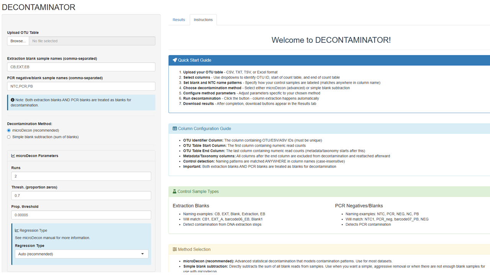

# DECONTAMINATOR

> An automated R script for removing contaminant reads from OTU/ASV tables using microDecon or simple blank subtraction

> [!IMPORTANT]
> **Preliminary data analysis tool, subject to ongoing development. Results should be interpreted with appropriate caution and validated with statistical rigor.**

## Live Application

Click the image below to launch the interactive NMDS ordination tool:

[](https://blueplanet.shinyapps.io/decontaminator/)

##  Description

This script provides a command-line/script-based alternative to the Shiny app "DECONTAMINATOR", allowing users to automatically detect and remove contaminant reads from sequencing data. It supports both extraction blanks and PCR negatives (NTCs) and offers two decontamination methods.

##  Features

- **Automatic blank detection** - Case-insensitive pattern matching for control samples
- **Two decontamination methods**:
  - `microDecon` - Advanced statistical decontamination (recommended)
  - `simple` - Direct blank read subtraction
- **Metadata preservation** - Automatically reattach taxonomy and metadata columns
- **Zero-row removal** - Remove OTUs with no reads after decontamination
- **CSV output** - Ready-to-use decontaminated tables and removed reads logs

## Data Format Requirements

### OTU Table (CSV)
- First column: OTU IDs (must be unique)
- Other columns: Samples as column names
- Values: Numeric counts or abundances


##  Installation

### Install required packages:

```r
# Required packages
install.packages(c("tidyverse", "readxl"))

# Install microDecon from GitHub
install.packages("remotes")
remotes::install_github("dtml-mkm/microDecon")
```

## Running

### Change user settings

Before running the script, modify the user settings at the end to match your project files. For instance:

```r
# Column names in your OTU table
otu_id_col <- "OTU_ID"        # Change to your OTU ID column name
otu_start_col <- "Sample1"    # Change to your first count column
otu_end_col <- "SampleN"      # Change to your last count column

# Control sample detection
blank_prefixes <- c("CB", "EXT", "EB")     # Your extraction blank prefixes
ntc_prefixes <- c("NTC", "PCR", "PB")      # Your PCR blank prefixes

# Decontamination method
decon_method <- "microdecon"   # "microdecon" or "simple"

# Output settings
output_dir <- "."              # Where to save results
output_prefix <- "my_data"     # Prefix for output files
```

### Notes

Notes
- At least one blank/control sample is required
- Sample columns with zero total reads are removed automatically
- OTUs with zero counts after decontamination are removed
- Column name matching for controls is case-insensitive

## Citation
If you use microDecon, please cite:
- McKnight et al. (2019). microDecon: A highly accurate read-subtraction tool for the post-sequencing removal of contamination in metabarcoding studies.
